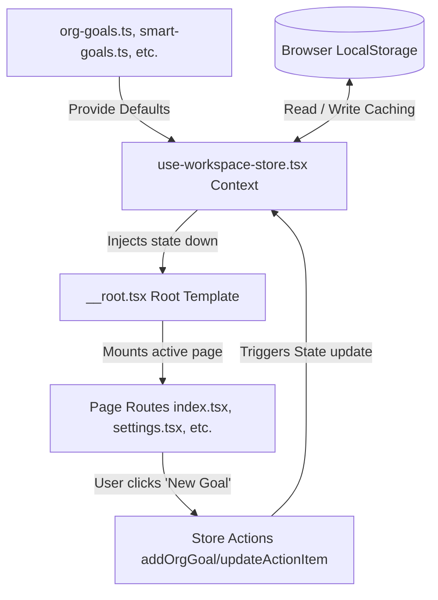

# Project Architecture & Workflow Documentation

This document explains the architecture, folder structure, and runtime data flow of the application.

---

## 1. Directory Structure Overview

The application is structured into modular folders under the `src` directory, dividing responsibilities among routing, page components, global state, and static mock databases:

```
src/
├── components/          # Reusable UI widgets, layout headers, and charts
│   ├── ui/              # Base shadcn styling components (buttons, dialogs, etc.)
│   ├── app-sidebar.tsx  # Sidebar navigation sidebar panel
│   ├── kanban-board.tsx # Generic board layout for task categories
│   └── top-bar.tsx      # Global header containing the back button, search, and avatar
│
├── hooks/               # Custom hooks and state management providers
│   ├── use-mobile.tsx   # Screen responsive mobile check
│   └── use-workspace-store.tsx # React Context provider managing global data
│
├── lib/                 # Core utilities, types, and mock databases
│   ├── org-goals.ts     # Organization goals data templates
│   ├── smart-goals.ts   # SMART goals data templates
│   ├── action-plans.ts  # Action plans/tasks data templates
│   ├── challenges.ts    # Challenges/blockers data templates
│   ├── solutions.ts     # Solutions/ideas data templates
│   └── mock-data.ts     # Main entry point re-exporting the files above
│
├── routes/              # Routing pages and layout trees
│   ├── __root.tsx       # Parent layout that wraps all pages
│   ├── index.tsx        # Dashboard landing page
│   └── (other pages)    # Specific sub-routes (settings, reports, etc.)
│
├── routeTree.gen.ts     # TanStack Router auto-generated tree mapping
├── server.ts            # Server entry for SSR rendering
└── start.ts             # Client entry bootstrapping the front-end
```

---

## 2. Dynamic Workflow & Data Lifecycle

The application operates as a single-page client-rendered application with persistent browser caching. The runtime data flows through five core phases:

### Phase A: App Bootstrapping
1. The user opens the site in their browser.
2. Vite bundles the application starting from the client script entry point.
3. The root layout component is initialized. This layout wraps the entire page structure inside the Workspace State Provider.

### Phase B: State Initialization (Memory & Cache)
1. The Workspace State Provider evaluates.
2. It sets up multiple React state hooks (one for organization goals, one for smart goals, etc.).
3. When the component mounts, a lifecycle check runs:
   - It checks the browser's persistent cache (**LocalStorage**).
   - If previous data exists, it updates the React state variables with the cached version.
   - If no cache is found (first visit), it loads the default mock data from your split files as a fallback and populates the cache.

### Phase C: Routing & Layout Matching
1. The TanStack Router evaluates the active browser path (e.g., `/organization-goals`).
2. It loads the global sidebar and top navigation bars inside the layout.
3. It mounts the requested page component into the main content window.

### Phase D: Dynamic Page Rendering
1. The loaded page component calls the global store hook.
2. It fetches the live state variables (e.g. the organization goals list).
3. The page maps over the goals list, dynamically generating cards, charts, and table rows based on the properties of each goal (like progress bar percentage, statuses, and counts).

### Phase E: Interactive Updates (Write Loop)
1. When a user creates a new goal or updates progress:
   - The form values are validated.
   - A create or update function is triggered on the global store.
   - The store generates a unique ID, builds the updated goal object, and replaces the React state array.
   - The store writes the serialized JSON copy directly back to **LocalStorage** to preserve the change.
   - React detects that the state array has changed, triggers a re-render, and updates all visual counts, KPI metrics, and cards across the website instantly.

---

## 3. Visual Workflow Diagram

This flowchart illustrates how data resolves from the mock source files down to the user's browser storage and visual layout rendering:


